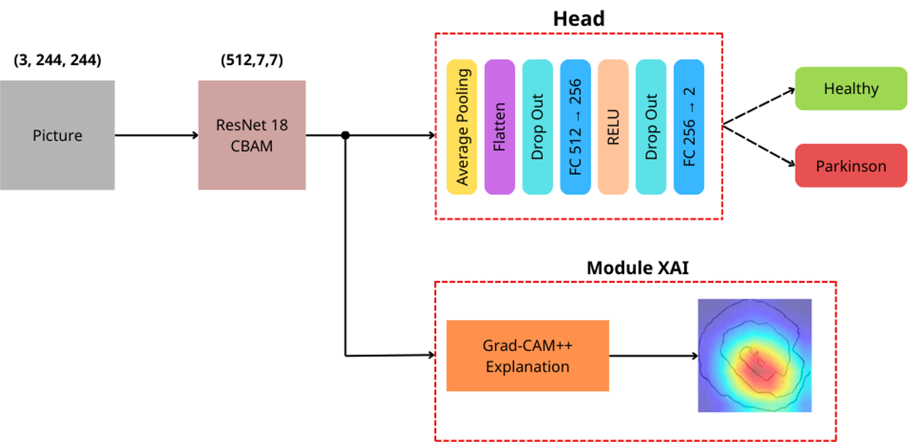
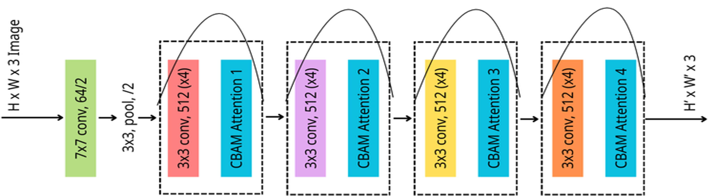
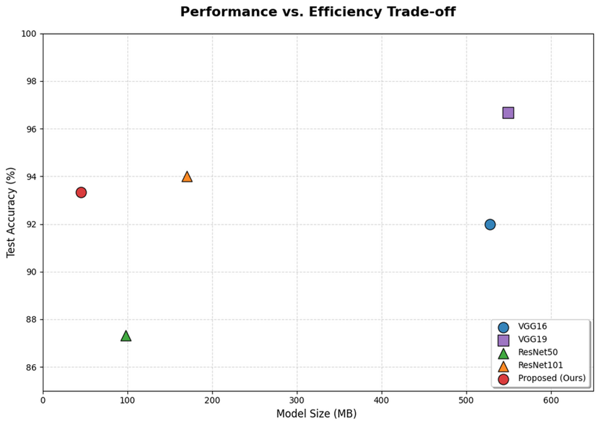
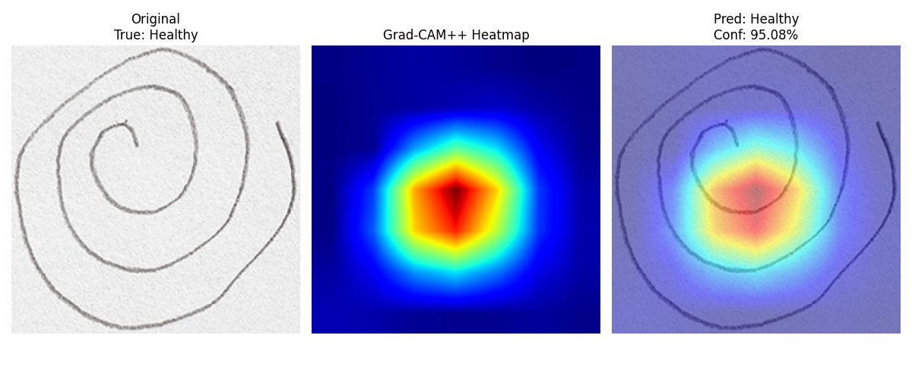
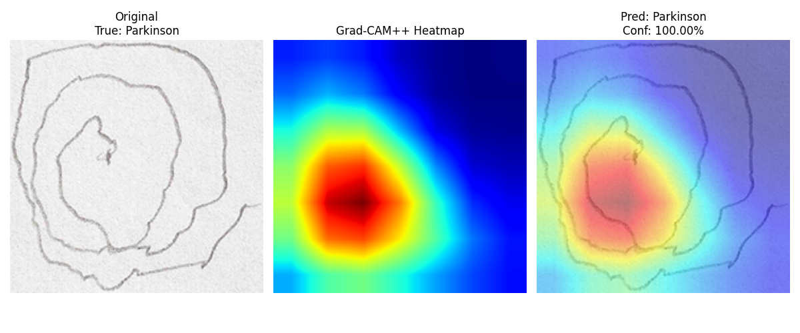

# Early Detection of Parkinson’s Disease Using Spiral Drawing Analysis

## 📌 Overview

This project focuses on **early screening of Parkinson’s Disease (PD)** in elderly individuals by analyzing **hand-drawn spiral images**. Parkinson’s Disease often causes tremors and loss of fine motor control, which can be reflected in spiral drawing patterns.

The goal is to build a **lightweight, accurate, and explainable deep learning model** that can support early diagnosis, especially in **resource-constrained areas** where access to neurologists is limited.

This project was developed as part of the **USR “Co-Creating a Happy Life for the Elderly” Achievement Competition** at **National Chung Cheng University**.

---

## 🎯 Problem Statement

* Parkinson’s Disease leads to tremors and impaired motor control.
* Early diagnosis is crucial but challenging due to:

  * Limited access to medical specialists
  * High costs and time constraints
* Elderly populations in remote areas are especially affected.

---

## 🔍 Scope & Application

* Early screening of Parkinson’s Disease using **static images of hand-drawn spirals**
* Applications:

  * Clinical decision support tool
  * Accessible and non-invasive screening method
  * Support elderly healthcare rights through timely assessment

---

## 🧠 Methodology

### Model Architecture 

The proposed system is built upon **ResNet18** with multiple custom enhancements:

#### 1. Backbone Network 

* **ResNet18** used for initial feature extraction

#### 2. CBAM Integration

* Custom implementation of **Convolutional Block Attention Module (CBAM)**
* Enhances important spatial and channel-wise features

#### 3. Classification Head

* Custom-designed fully connected (FC) layers
* Optimized for **binary classification** (Healthy vs Parkinson)

#### 4. Explainable AI (XAI)

* **Grad-CAM++** implemented to visualize model attention
* Helps interpret predictions and improve clinical transparency

#### 5. Deployment

* Model deployed via a **web-based interface** for demonstration

---

## 📊 Results

### Performance

* **Test Accuracy:** 93%
* **Precision / Recall / F1-score:** ~93%

### Efficiency

* Smaller model size compared to other methods
* Suitable for real-world deployment

### Explainability (Grad-CAM++)

* **Healthy spirals:** Heatmaps follow smooth, regular strokes
* **Parkinson spirals:** Heatmaps highlight irregular, tremor-like regions

These visual explanations increase trust and interpretability for medical use.

---

## 👥 Team & Contributions

| Member              | Contribution                                                            |
| ------------------- | ----------------------------------------------------------------------- |
| **Nguyen Thuc Nhi** | 40% – Model architecture design, training, poster & presentation slides |
| **Nguyen Van Duc**  | 30% – Research paper, slides, poster                                    |
| **Tran Thanh Nhu**  | 30% – Research documentation, website deployment                        |

---

## 🏫 Institution

**National Chung Cheng University**
USR “Co-Creating a Happy Life for the Elderly” Program

---

## 🙏 Acknowledgements

Special thanks to the USR program, instructors, and teammates for their guidance and collaboration throughout this project.
